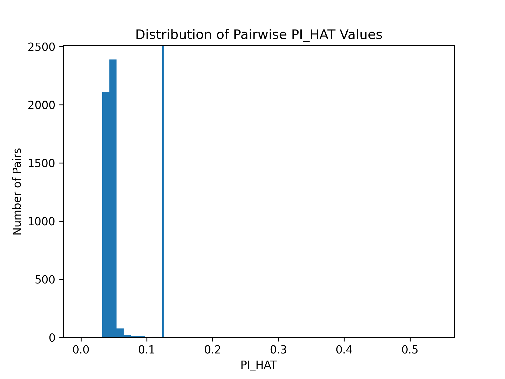

# CSE284_IBD_methods_comparison

## Overview
The goal of this project is to compare the IBD analysis of 3 tools: plink 1.9, germline, and Beagle. Plink utilizes a Method of Moments estimator to compute the probability that a pair of individuals shares 0, 1, or 2 alleles IBD across the genome. Germline uses a hashing based technique to run in linear time with respect to the number of individuals. Beagle uses a refined IBD algorithm, which utilizes a HMM and computes a log odds score (LOD score) of how likely a segment is to be in IBD. 


## Data
The dataset that we will be analyzing is the 1000 Genomes Phase 3 release, consisting of 2504 individuals from 26 different populations. Our analysis will focus on the subset of individuals from the LWK population. This dataset uses the GRCh37 reference genome and includes VCF files for every chromosome containing genotype information regarding variants for every individual. Individuals were sequenced with whole-genome sequencing with a mean depth of 7.4x and targeted exome sequencing with a mean depth of 65.7x. 


## Dependencies
```
pip install matplotlib
pip install pandas
```
## Instructions to reproduce results
For reference, all scripts should be run from the root directory (unless otherwise specified) in order to run properly. Download plink v1.9, germline, Beagle 4.1, and Beagle 5.5 from their respective websites and store them in a directory ```tools/```

### Obtain VCF file
We started with the ps2 data from problem 3 in .bed, .bim, and .fam format, which you can find in ```data/```. First the data must be converted to a VCF file:
```
plink --bfile data/ps2_ibd.lwk --recode vcf --out data/ps2_ibd.lwk
```

### Get and process map files
The GRCh37 map was obtained through the Beagle website:
```
wget -O  data/maps/plink.GRCh37.map.zip https://bochet.gcc.biostat.washington.edu/beagle/genetic_maps/plink.GRCh37.map.zip
```
Navigate to the ```data/maps/``` directory and run the following Bash commands:
```
for file in plink.chr*.GRCh37.map; do \
     chr=$(echo $file | sed 's/plink.chr\([0-9]*\)\.GRCh37\.map/\1/') \
     mv "$file" "chr${chr}.map" \
     echo "Renamed $file to chr${chr}.map" \
 done
```
```
cat chr{1..22}.map > combined_map.map
```

### Phase VCF file
Our VCF file was phased with Beagle 5.5. Navigate back to the home directory and run the ```phase.sh``` script.
```
bash scripts/phase.sh
```

### Convert VCF to .ped file for germline and run germline
```
bash scripts/germline_pipeline.sh
```

### Compute IBD with the other 2 tools
```
bash scripts/beagle_ibd.sh
bash scripts/compute_ibd_plink.sh
```

### Analyze results
```
python3 scripts/beagle_analysis.py
python3 scripts/germline_analysis.py
python3 plot_pihat_distribution.py
```

## Results so far
Currently we have computed the pi_hat distributions using plink, as well as cumulative IBD distribution from Beagle:



## Remaining work to complete
There is currently a large discrepancy between the total number of segments, mean segment length, median segment length, and max segment length computed by germline as opposed to Beagle. We believe it is an issue with the input .ped file and will work to correct it. Some other future steps include:
- Comparing runtime of each method
- Estimating pi_hat from germline and Beagle results and comparing to plink
- Further analyzing the 3 methods in terms of their IBD outputs
- Reorganize confusing file paths and output locations
- Update readme with the new results and guidance of peer reviewers
