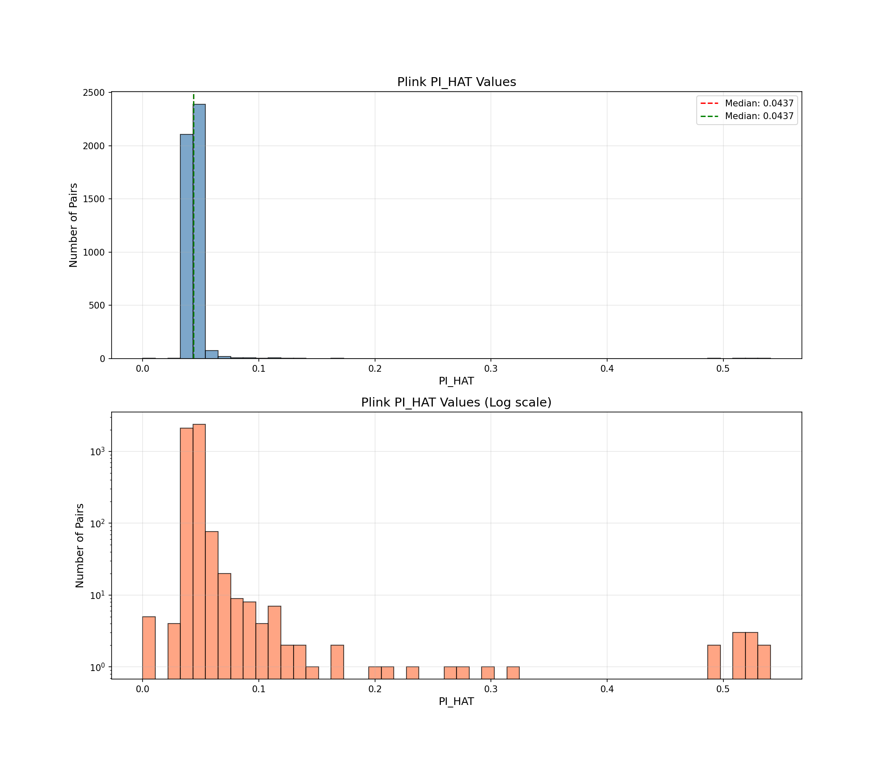
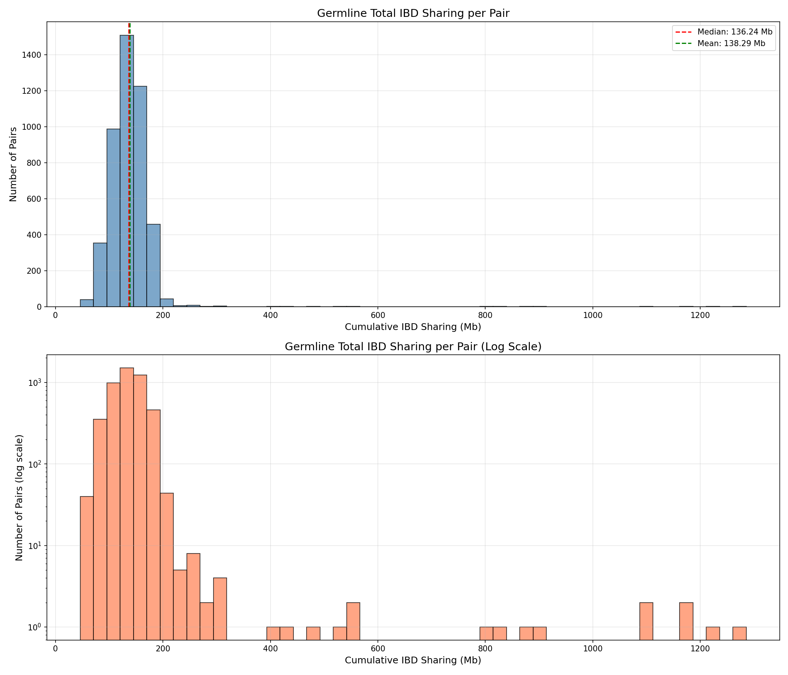
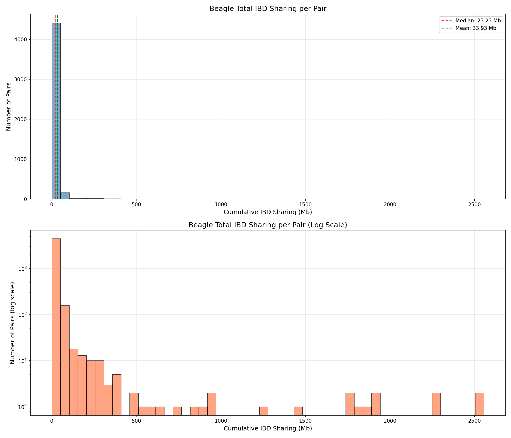
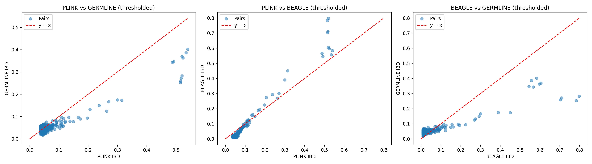

# CSE284_IBD_methods_comparison

## Overview
The goal of this project is to compare the IBD analysis of 3 tools: plink 1.9, germline, and Beagle. Plink utilizes a Method of Moments estimator to compute the probability that a pair of individuals shares 0, 1, or 2 alleles IBD across the genome. Germline uses a hashing based technique to run in linear time with respect to the number of individuals. Beagle uses a refined IBD algorithm, which utilizes a HMM and computes a log odds score (LOD score) of how likely a segment is to be in IBD. 


## Data
The dataset that we will be analyzing is the 1000 Genomes Phase 3 release, consisting of 2504 individuals from 26 different populations. Our analysis will focus on the subset of individuals from the LWK population, which consists of 97 individuals and 911045 SNPs. This dataset uses the GRCh37 reference genome and includes VCF files for every chromosome containing genotype information regarding variants for every individual. Individuals were sequenced with whole-genome sequencing with a mean depth of 7.4x and targeted exome sequencing with a mean depth of 65.7x. 


## Dependencies
```
pip install matplotlib
pip install pandas
pip install numpy
```
plink v1.9, germline, Beagle 4.1, and Beagle 5.5 are also required. Follow the steps below for installation.

## Instructions to reproduce results
For reference, all scripts should be run from the root directory (unless otherwise specified) in order to run properly. Download plink v1.9, germline, Beagle 4.1, and Beagle 5.5 by running:
```
bash scripts/install_tools.sh
```

### Obtain VCF file
We started with the ps2 data from problem 3 in .bed, .bim, and .fam format, which you can find in ```data/```. First the data must be converted to a VCF file:
```
plink --bfile data/ps2_ibd.lwk --recode vcf --out data/ps2_ibd.lwk
```

### Get and process map files
Instructions to get and process the map files. They are located in ```data/maps/``` for your convenience. Below are the scripts used to obtain the map files:
The GRCh37 map was obtained through the Beagle website:
```
wget -O  data/maps/plink.GRCh37.map.zip https://bochet.gcc.biostat.washington.edu/beagle/genetic_maps/plink.GRCh37.map.zip
```
Navigate to the ```data/maps/``` directory and run the following Bash commands:
```
for file in plink.chr*.GRCh37.map; do \
     chr=$(echo $file | sed 's/plink.chr\([0-9]*\)\.GRCh37\.map/\1/') \
     mv "$file" "chr${chr}.map" \
     echo "Renamed $file to chr${chr}.map" \
 done
cat chr{1..22}.map > combined_map.map
```

### Phase VCF file
Our VCF file was phased with Beagle 5.5. The phased .gz vcf has already been generated for your convenience in ```data/```. Below are instructions to phase the data using Beagle:
Navigate back to the root directory and run the ```phase.sh``` script.
```
bash scripts/phase.sh
```

### Convert VCF to .ped file for germline
```
bash scripts/germline_preprocess.sh
```

### Compute IBD with the 3 tools and measure runtime + peak memory
```
python3 scripts/timer.py ./scripts/compute_ibd_plink.sh
python3 scripts/timer.py ./scripts/germline.sh
python3 scripts/timer.py ./scripts/beagle_ibd.sh
```
The runtime and peak memory results of our analysis are stored in ```results/runtime.txt```.
### Analyze results
```
python3 scripts/beagle_analysis.py
python3 scripts/germline_analysis.py
python3 scripts/plot_plink_pihat_dist.py
python3 scripts/combine_ibd_results.py
python3 scripts/ibd_tool_difference.py
python3 scripts/plot_ibd_comparison.py
```
Various plots and .csv files are available in the ```results/``` folder, the most important of which are displayed below in the Results section. Results for each tool are separated into their respective folders bearing the tool's name. For Beagle and Germline, those results include IBD by chromosome, cumulative IBD distribution, IBD summary statistics, pairwise IBD sharing, pairwise PI_HAT, and PI_HAT distribution.
## Results
We computed runtime and peak memory for each of the three tools:

|  | Runtime (s) | Peak Memory (kb) |
| --- | --- | --- |
| Plink | 1.26 | 51104 |
| Germline | 75.46 | 54832 |
| Beagle | 189.41 | 1032292 |

Below are the following cumulative IBD segment length distributions for each of the 3 tools. 




We then compared the PI_HAT result of the tools on a pairwise basis. PI_HAT for Plink was taken directly from the output of the tool. For Beagle and Germline, it was computed as the sum of IBD segment lengths divided by the genome length, which we assumed was 3200 Mb. At lower values of PI_HAT, the 3 tools perform similarly, but at higher PI_HAT values, Germline underpredicted compared to Plink, while Beagle overpredicted compared to Plink.



